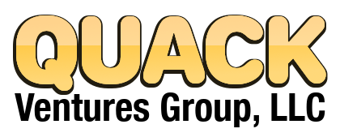

# Home to Satire Based Investing

Welcome to the digital home of QUACK Ventures Group, LLC, where our primary objective is to scrutinize the AI revolution as it unfolds through the proliferation of large language models. In recent times, these technologies have experienced an upswing in adoption rates, reminiscent of the early days of the internet, and their transformative potential has yet to be fully grasped by the masses.

Creative minds such as artists and writers will undoubtedly conceive ideas that would have been impossible without the aid of artificial intelligence. One such example is the satirical exploration of postmodern capital systems, which, in their absurdity, manage to generate more wealth than ventures that address humanity's most pressing concerns, including education, environmental stewardship, and hunger alleviation (Baudrillard, 1988; Schiller, 2000).

QUACK Ventures Group, LLC endeavors to provide a lucid perspective on the bewildering capitalist infrastructure, examining it through a lens that combines both whimsy and a genuine reflection of extant investment vehicles. Our projects encompass the development of open portfolios, open-source software, and the publication of numerous AI-assisted literary works. By harnessing human-guided AI, we strive to produce content that illuminates the pervasive madness residing in the most advanced corners of our world (Kesey, 1962; Hesse, 1927).

This GitHub repository will serve as a launchpad for a diverse array of ventures, each one more outlandish than its predecessor. We cordially invite you to join us on this fascinating journey.

### CONTENTS
* **DuckSlabs.com** [Repo](https://github.com/QUACKVenturesGroup/QUACKVenturesGroup.github.io/blob/main/index.html)[Site](https://QUACKVenturesGroup.github.io/): Welcome to DuckSlabs.com, where the MALLARD™ system blends satire and asset evaluation to revolutionize investing. Our unique approach as demonstrated by our physical, collectible guides, focuses on authenticated duck-themed assets, creating a comprehensive ecosystem of financial satire, branding, and education. Trust DuckSlabs to guide you through the financial pond and uncover wealth in the realm of the absurd.
* [QUACKARS License](https://github.com/QUACKVenturesGroup/QUACKVenturesGroup.github.io/blob/main/QUACKARS_License.md): All QUACK Ventures Group, LLC software is distributed under the QUACK Absurdly Restrictive Software License or QUACKARS. In the manner of an open-source license, this document presents itself with a curious penchant for the absurd, all the while preserving a veneer of legal legitimacy. Entwined in its peculiar demands, such as the perpetual exhibition of a whimsical duck illustration, a stipulation of dimensions no less, the license challenges the orthodox boundaries of software agreements. Nevertheless, it remains steadfast in its commitment to the fundamental tenets of Free and Open-Source Software.

References:

* Baudrillard, J. (1988). America. Verso.
* Hesse, H. (1927). Steppenwolf. S. Fischer Verlag.
* Kesey, K. (1962). One Flew Over the Cuckoo's Nest. Viking Press.
    Schiller, R. J. (2000). Irrational Exuberance. Princeton University Press.
